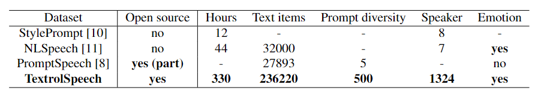

{:.no_toc}

# Authors
<ul>
    <li> <b>Shengpeng Ji</b>1</li>
    <li> <b>Jialong Zuo</b>1</li>
    <li> <b>Minghui Fang</b>1</li>
    <li> <b>Ziyue Jiang</b>1</li>
    <li> <b>Feiyang Chen</b>2</li>
    <li> <b>Xinyu Duan</b>2</li>
    <li> <b>Baoxing Huai</b>2</li>
    <li> <b>Zhou Zhao</b>1*</li>
</ul>

 1 ZheJiang University   
 2 HuaWei Cloud   
 * Corresponding Author   

 

# Abstract
Recently, there has been a growing interest in the field of controllable Text-to-Speech (TTS). While previous studies have relied on users providing specific style factor values based on acoustic knowledge or selecting reference speeches that meet certain requirements, generating speech solely from natural text prompts has emerged as a new challenge for researchers. This challenge arises due to the scarcity of high-quality speech datasets with natural text style prompt and the absence of advanced text-controllable TTS models. In light of this, 1) we propose TextrolSpeech, which is the first large-scale speech emotion dataset annotated with rich text attributes. The dataset comprises 236,220 pairs of style prompt in natural text descriptions with five style factors and corresponding speech samples. Through iterative experimentation, we introduce a multi-stage prompt programming approach that effectively utilizes the GPT model for generating natural style descriptions in large volumes. 2) Furthermore, to address the need for generating audio with greater style diversity, we propose an efficient architecture called Salle. This architecture treats text controllable TTS as a language model task, utilizing audio codec codes as an intermediate representation to replace the conventional mel-spectrogram. Finally, we successfully demonstrate the ability of the proposed model by showing a comparable performance in the controllable TTS task.

 

# TextrolSpeech

We believe that utilizing natural text descriptions for controlling style in speech is the direction for future development of controllable TTS systems, due to its user-friendliness, generalizability, and interpretability. However, to the best of our knowledge, there is currently no high-quality, large-scale open-source text style prompt speech dataset available for advanced text-controllable TTS models. In this work, we introduce a novel 330-hour clean text style prompt speech emotion dataset called TextrolSpeech. Each style encompasses 5 style factors and 500 distinct natural language text descriptions.
 

 

The figure below shows two example word clouds for style descriptions.
 

 

The figure below shows the distribution of emotions in TextrolSpeech.
 

 

We have released a demo version containing 500 style descriptions on this page with five style factors: female, high pitch, normal speaking speed, low energy, neutral. You can click <a href="demo_version.txt" download="demo.txt">demo_version</a> to download.
If you want to get the full dataset, please contact the following email address and refer to the following <a href="apply.md" download="apply_form.md">format</a>.
<ul>
<li> <a href="mailto:shengpengji@zju.edu.cn">shengpengji@zju.edu.cn</a> </li>
<li> <a href="mailto:jialongzuo@zju.edu.cn">jialongzuo@zju.edu.cn</a> </li>
<li> <a href="mailto:minghuifang@zju.edu.cn">minghuifang@zju.edu.cn</a> </li>
</ul>

 

# Diversity

<ruby>Text: A doctor believes this boy to be mad.</ruby>
<table>
	<thead>
		<tr>
			<th style="text-align: center">Style Prompt</th>
            <th style="text-align: center">Audio</th>
		</tr>
	</thead>
	<tbody>
        <tr>
			<td>
            With a low pitch and customary speaking speed, his communication conveys an overall sense of subdued energy.
            </td>
            <td style="text-align: center">
            <audio controls style="width: 300px;"><source src="wav_for_demo/demo1/98_decompressed.wav" type="audio/wav"></audio>
            </td>
		</tr>
        <tr>
			<td>
            A <b>mad</b> man speaks in a lower tone and a customary pace, evoking an air of diminished enthusiasm.
            </td>
            <td style="text-align: center">
            <audio controls style="width: 300px;"><source src="wav_for_demo/demo1/68_decompressed.wav" type="audio/wav"></audio>
            </td>
		</tr>
        <tr>
			<td>
            The man employs a deep tone and average speaking speed, projecting an overall low vitality.
            </td>
            <td style="text-align: center">
            <audio controls style="width: 300px;"><source src="wav_for_demo/demo1/132_decompressed.wav" type="audio/wav"></audio>
            </td>
		</tr>
        <tr>
			<td>
            The male speaker's energetic discourse is accompanied by a normal pitch and speed.
            </td>
            <td style="text-align: center">
            <audio controls style="width: 300px;"><source src="wav_for_demo/demo1/56_decompressed.wav" type="audio/wav"></audio>
            </td>
		</tr>
         <tr>
			<td>
            The man's deep voice and dynamic speaking style maintain high energy at a normal speed.
            </td>
            <td style="text-align: center">
            <audio controls style="width: 300px;"><source src="wav_for_demo/demo1/194_decompressed.wav" type="audio/wav"></audio>
            </td>
		</tr>
        <tr>
			<td>
            The man's low-pitched voice maintains an even speaking tempo, evoking a subdued vitality.
            </td>
            <td style="text-align: center">
            <audio controls style="width: 300px;"><source src="wav_for_demo/demo1/8_decompressed.wav" type="audio/wav"></audio>
            </td>
		</tr>
        <tr>
			<td>
            The man employs a low-pitched voice, keeping a regular rhythm and usual energy in conversation.
            </td>
            <td style="text-align: center">
            <audio controls style="width: 300px;"><source src="wav_for_demo/demo1/136_decompressed.wav" type="audio/wav"></audio>
            </td>
		</tr>
        <tr>
			<td>
            The woman's voice is vibrant, high-pitched, and delivered rapidly.
            </td>
            <td style="text-align: center">
            <audio controls style="width: 300px;"><source src="wav_for_demo/demo1/144_decompressed.wav" type="audio/wav"></audio>
            </td>
		</tr>
        <tr>
			<td>
            A woman's high-pitched voice flows rapidly, reflecting regular energy.
            </td>
            <td style="text-align: center">
            <audio controls style="width: 300px;"><source src="wav_for_demo/demo1/388_decompressed.wav" type="audio/wav"></audio>
            </td>
		</tr>
        <tr>
			<td>
            His low-pitched speech flows naturally as he maintains a regular cadence and usual energy level.
            </td>
            <td style="text-align: center">
            <audio controls style="width: 300px;"><source src="wav_for_demo/demo1/308_decompressed.wav" type="audio/wav"></audio>
            </td>
		</tr>
        <tr>
			<td>
            The male speaker talks with a deep voice, neither rushed nor sluggish, and maintains balanced energy.
            </td>
            <td style="text-align: center">
            <audio controls style="width: 300px;"><source src="wav_for_demo/demo1/382_decompressed.wav" type="audio/wav"></audio>
            </td>
		</tr>
        <tr>
			<td>
            With heightened volume, she conveys her high energy.
            </td>
            <td style="text-align: center">
            <audio controls style="width: 300px;"><source src="wav_for_demo/demo1/396_decompressed.wav" type="audio/wav"></audio>
            </td>
		</tr>
        <tr>
			<td>
            A male speaker's conversation bursts with high energy through his low-pitched voice at a natural speed.
            </td>
            <td style="text-align: center">
            <audio controls style="width: 300px;"><source src="wav_for_demo/demo1/270_decompressed.wav" type="audio/wav"></audio>
            </td>
		</tr>
	</tbody>
</table>

 

<ruby>Text: Racism has no place in any sport.</ruby>
<table>
	<thead>
		<tr>
			<th style="text-align: center">Style Prompt</th>
            <th style="text-align: center">Audio</th>
		</tr>
	</thead>
	<tbody>
        <tr>
			<td>
            The male speaker's deep voice and normal speaking tempo combine to create a subdued atmosphere, brimming with a lack of energy.
            </td>
            <td style="text-align: center">
            <audio controls style="width: 300px;"><source src="wav_for_demo/demo2/159_decompressed.wav" type="audio/wav"></audio>
            </td>
		</tr>
        <tr>
			<td>
            His fast speaking pace and deep voice mirror his lack of energy.
            </td>
            <td style="text-align: center">
            <audio controls style="width: 300px;"><source src="wav_for_demo/demo2/285_decompressed.wav" type="audio/wav"></audio>
            </td>
		</tr>
		<tr>
			<td>
            With a fast speaking speed, she recounted the adventure.
            </td>
            <td style="text-align: center">
            <audio controls style="width: 300px;"><source src="wav_for_demo/demo2/13_decompressed.wav" type="audio/wav"></audio>
            </td>
		</tr>
        <tr>
			<td>
            Her voice is sharp, yet her <b>enraged</b> speaking rate is standard.
            </td>
            <td style="text-align: center">
            <audio controls style="width: 300px;"><source src="wav_for_demo/demo2/163_decompressed.wav" type="audio/wav"></audio>
            </td>
		</tr>
        <tr>
			<td>
            She talks gently, her <b>sorrowful</b> speed unhurried.
            </td>
            <td style="text-align: center">
            <audio controls style="width: 300px;"><source src="wav_for_demo/demo2/17_decompressed.wav" type="audio/wav"></audio>
            </td>
		</tr>
        <tr>
			<td>
            Speaking with normal energy, she conversed swiftly.
            </td>
            <td style="text-align: center">
            <audio controls style="width: 300px;"><source src="wav_for_demo/demo2/331_decompressed.wav" type="audio/wav"></audio>
            </td>
		</tr>
        <tr>
			<td>
            A male speaker utilizes a deep tone and normal speaking speed, resulting in a presentation with diminished liveliness.
            </td>
            <td style="text-align: center">
            <audio controls style="width: 300px;"><source src="wav_for_demo/demo2/213_decompressed.wav" type="audio/wav"></audio>
            </td>
		</tr>
        <tr>
			<td>
            The woman's voice resonated slowly, her <b>miserable</b> energy remaining low, pitch high.
            </td>
            <td style="text-align: center">
            <audio controls style="width: 300px;"><source src="wav_for_demo/demo2/47_decompressed.wav" type="audio/wav"></audio>
            </td>
		</tr>
	<tr>
			<td>
            A deliberate and unhurried male voice, with a low pitch that exudes a tranquil yet grounded energy.
            </td>
            <td style="text-align: center">
            <audio controls style="width: 300px;"><source src="wav_for_demo/demo2/257_decompressed.wav" type="audio/wav"></audio>
            </td>
		</tr>
        <tr>
			<td>
            The woman's voice conveys enthusiasm and a normal tone.
            </td>
            <td style="text-align: center">
            <audio controls style="width: 300px;"><source src="wav_for_demo/demo2/287_decompressed.wav" type="audio/wav"></audio>
            </td>
		</tr>
        <tr>
			<td>
            His speaking style, marked by a deep pitch and rapid pace, signifies his low energy.
            </td>
            <td style="text-align: center">
            <audio controls style="width: 300px;"><source src="wav_for_demo/demo2/377_decompressed.wav" type="audio/wav"></audio>
            </td>
		</tr>
        <tr>
			<td>
            In a deliberate manner, she speaks with a deep voice.
            </td>
            <td style="text-align: center">
            <audio controls style="width: 300px;"><source src="wav_for_demo/demo2/317_decompressed.wav" type="audio/wav"></audio>
            </td>
		</tr>
        <tr>
			<td>
            Speaking slowly and deliberately, her <b>miserable</b> voice exhibited a high pitch and quiet tone.
            </td>
            <td style="text-align: center">
            <audio controls style="width: 300px;"><source src="wav_for_demo/demo2/21_decompressed.wav" type="audio/wav"></audio>
            </td>
		</tr>
	</tbody>
</table>

# Generalization

<ruby>We show the model's ability to generalize to unknown emotions, such as the voice of despair.</ruby>
<table>
	<thead>
		<tr>
			<th style="text-align: center">Style Prompt</th>
            <th style="text-align: center">Text</th>
            <th style="text-align: center">Audio</th>
		</tr>
	</thead>
	<tbody>
        <tr>
			<td>
            The despair woman's high-pitched voice carried a slow speech.
            </td>
            <td>
            A doctor believes this boy to be mad.
            </td>
            <td style="text-align: center">
            <audio controls style="width: 200px;"><source src="wav_for_demo/demo3/1_decompressed.wav" type="audio/wav"></audio>
            </td>
		</tr>
        <tr>
			<td>
            The despair woman's high-pitched voice carried a slow yet energetic speech.
            </td>
            <td>
            Racism has no place in any sport.
            </td>
            <td style="text-align: center">
            <audio controls style="width: 200px;"><source src="wav_for_demo/demo3/2_decompressed.wav" type="audio/wav"></audio>
            </td>
		</tr>
        <tr>
			<td>
            Rapidly speaking, the despair man's deep voice resonates with a sense of normal energy.
            </td>
            <td>
            A doctor believes this boy to be mad.
            </td>
            <td style="text-align: center">
            <audio controls style="width: 200px;"><source src="wav_for_demo/demo3/3_decompressed.wav" type="audio/wav"></audio>
            </td>
		</tr>
        <tr>
			<td>
            The despair woman's voice resonated slowly, her miserable energy remaining low, pitch high.
            </td>
            <td>
            Racism has no place in any sport.
            </td>
            <td style="text-align: center">
            <audio controls style="width: 200px;"><source src="wav_for_demo/demo3/4_decompressed.wav" type="audio/wav"></audio>
            </td>
		</tr>
        <tr>
			<td>
            A boy said in a desperate voice.
            </td>
            <td>
            One even gave my little dog a biscuit.
            </td>
            <td style="text-align: center">
            <audio controls style="width: 200px;"><source src="wav_for_demo/demo3/5_decompressed.wav" type="audio/wav"></audio>
            </td>
		</tr>
        <tr>
			<td>
            The despair woman's voice resonated slowly, her miserable energy remaining low, pitch high.
            </td>
            <td>
            One even gave my little dog a biscuit.
            </td>
            <td style="text-align: center">
            <audio controls style="width: 200px;"><source src="wav_for_demo/demo3/6_decompressed.wav" type="audio/wav"></audio>
            </td>
		</tr>        
	</tbody>
</table>

 
